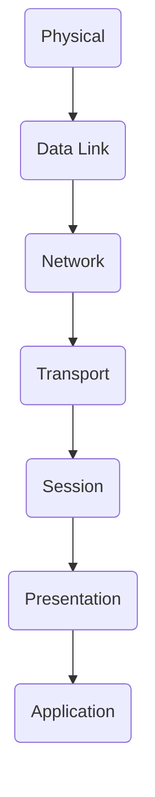
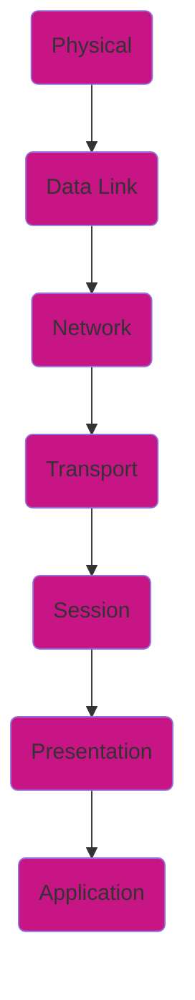

1. Physical
2. Data Link
3. Network
4. Transport
5. Session
6. Presentation 
7. Application

>example of calculator


```mermaid
flowchart 
A-->B-->C-->D-->E-->F-->G
A(Physical)
B(Data Link)
C(Network)
D(Transport)
E(Session)
F(Presentation)
G(Application)
```


​```

```mermaid
graph TD;

%% Class Definitions
%% =================

classDef FixFont font-size:11.5px;

%% Nodes
%% =====

A-->B-->C-->D-->E-->F-->G
A(Physical)
B(Data Link)
C(Network)
D(Transport)
E(Session)
F(Presentation)
G(Application)

%% Node styles
%% ===========

style A fill:mediumvioletred;
style B fill:mediumvioletred;
style C fill:mediumvioletred;
style D fill:mediumvioletred;
style E fill:mediumvioletred;
style F fill:mediumvioletred;
style G fill:mediumvioletred;
```
