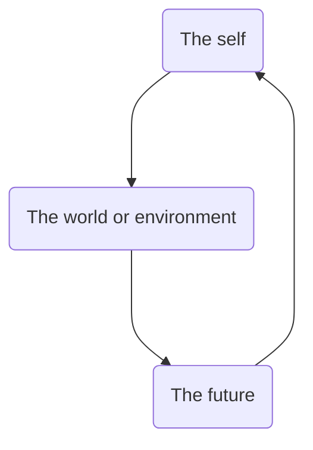

![[images/Aaron T Beck.jpg|100]]

**Aaron T Beck** (July 18, 1921 – November 1, 2021) - influential psychiatrist who is regarded as the **father of cognitive therapy** and **cognitive behavioural therapy**.

Designed many self report scales, including [[Beck's Depression Inventory]]. 

*The key to many psychological difficulties, Dr. Beck has found in 40 years of research and clinical work, lies not deep in the unconscious, but in ''thinking problems'' that are much closer to conscious awareness.*

automatic thoughts

*Patients in cognitive therapy are encouraged to test their perceptions of themselves and others, as if they were scientists testing hypotheses.*

His work at the University of Pennsylvania inspired Martin Seligman to refine his own cognitive techniques and later work on **learned helplessness**

Beck's cognitive triad

---

was inspired by Albert Ellis (founder of REBT)
inspired Martin Seligman(who proposed and defined **learned helplessness**)
worked with Maria Kovacs to make a depression scale for children

was inspired by stoicism