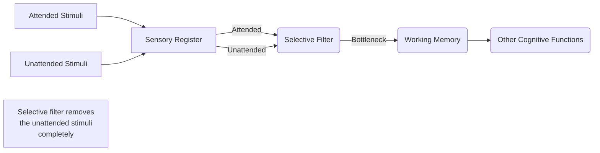
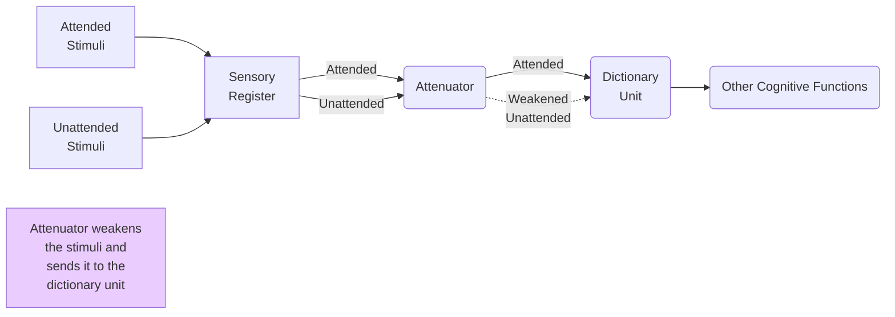
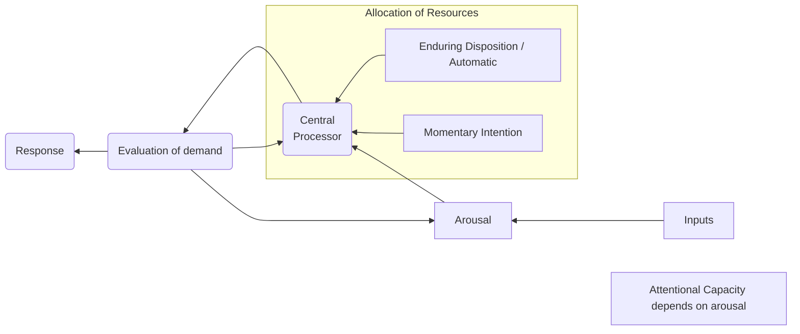
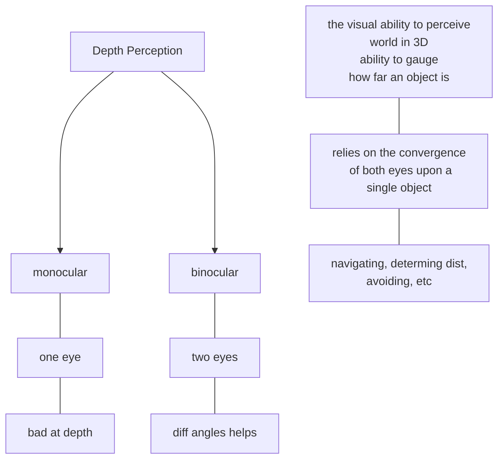

## <u>Portions</u>
1. Types of Attention: **Selective attention** and **Divided 
attention**
2. Theories of Attention: 
   (a) Theories of Selective  Attention: Broadbent’s model & Triesmann’s model, 
   (b) Theories of Divided Attention: Kahneman’s model
3. Perceptual Processes: Perception: Meaning and Definition
4. Gestalt laws of Perceptual Organisation
5. Depth Perception: Monocular and Binocular cues for depth perception
6. Constancy: Size Constancy, Brightness Constancy
7. Movement Perception: Real and Apparent Motion
8. Visual illusions: Muller-Lyer Illusion, Moon Illusion
9. Extra Sensory Perception

---
# Attention
## Meaning 

> [! QUESTION] What is Attention?
> Attention is a **cognitive process** of selectively concentrating on a **discrete  aspect of information**, whether considered subjective or objective, while  **ignoring other perceivable information**
>

> [! TLDR] TLDR; 
> Concentrating on one task while ignoring other stimuli (**filtering**)
> Prioritize stimuli based on goals and needs

## Factors Affecting Attention
|             Internal  aka subjective           |  External  |
|:--------------------------------:|:----------:|
|             Interest             |   Nature   |
|              Motive              | Intensity  |
|            Mental Set            |    Size    |
|             Past Exp             |  Contrast  |
|             Emotions             | Repetition |
|              Habits              |  Novelty   |
|               Aim                |  Location  |
| Meaningfulness of   material |  Movement  |

>[!mnemonic] 
>MMM, PIE AH? -> Internal 
>CRIMSoN NL -> External

### Internal Factors
AKA Subjective factors. Depend from person to person. 
1. **Interest** | 
2. **Motive** | basic needs and motives > other ones; what we want to do; task at hand
3. **Mental Set** |  readiness to respond; expecting a stimulus
4. **Past Experiences** | 
5. **Emotions** | 
6. **Habits** |
7. **Aim** |
8. **Organic state**| Hunger, sleep, etc

### External Factors
1. **Nature**    | Pic >>> Words
2. **Intensity** | Louder >> Softer
3. **Size**  |  Larger >> Smaller
4. **Repetition** | More times >> Less times
5. **Contrast** | Stark difference, can be in colours or concepts
6. **Novelty** | Something new, out of place
7. **Location** | Center >> other places
8. **Movement** | Moving >> Static

## Types of Attention
### 1. Based on Needs
a) **Sustained Attention**
	 it is the ability to pay attention to **only one task** by **consciously concentrating** on that task only for a **long time** enough and by **avoiding all other forms of distractions** or deviations. <u>Eg - reading a book, memorizing a chapter or following a classroom lecture.</u>
	
b) **Selective Attention**: 
	In this case, the listener **chooses to pay attention to only a *specific stimulus*** which is present in the environment while **ignoring the other stimuli**. This kind of attention does not depend on the stimulus but depends essentially on the attentive capabilities of an observer. Choosing to focus on a friend's voice (while in a crowd with them)
	
c) **Divided Attention**: 
	In case of divided attention, **the user pays attention to two or more *tasks* at the same time** and is also sometimes regarded as <strong><u>Multi-tasking</u></strong> which involves juggling between two or more than two tasks at the same time. Divided attention uses a lot of mental focus; ergo person **may get exhausted very quickly.** Function is impaired. **Split our attention**
	
d) **Alternating Attention**: 
	Though this attention can be closely related to divided attention, but is different as in case of divided attention we split our attention between two tasks, while in case of alternating attention, **the entire attention is shifted from one task to another** or is done alternately.

### 2. Based on Volition   
   a) **Voluntary** (aka volitional)
	requires will and determination
	**not** spontaneous
	*conscious effort*
	**goal based**
	eg - doing math 

   b) **Involuntary** (aka non-volitional)
	   does not involve any role of will
	   *instinctual* 
	   **spontaneous**
	   enforced attention
	   eg - mom hearing baby 

Auditory - ability to pay attention to auditory stimuli, related to temporal 
Visual - visual stimuli, related to spatial 

# <u>Models of Attention</u>
## **Selective**
### 1. Broadbent's Model of Selective Attention | Early Selection Theory

All stimuli is registered in the sensory register, and then they go through the selective filter which filters out <u>based on <b>physical characteristics</b></u>
After selective filter, **meaning** is assigned to the stimuli and then processed

**selection of stimuli** for processing occurs <b><u>before</u></b> **stimulus identification** (Early Selection)

<u><strong>Bottleneck theory</u></strong> - individuals have a limited amount of attentional resources that they can use at one time

### 2. Treisman's Model | **Attenuation Theory**
<b><u>Attenuation</u> </b>- the lessening or weakening in the intensity, value, or quality of a stimulus 

<u>unattended messages</u> are **attenuated** or processed weakly but **not** entirely blocked from further processing
	 Thus, a significant word (e.g., the person’s name) would have a <u>low threshold</u> and, when mentioned, would be recognized even if that person’s attention is concentrated elsewhere 
	(**Cocktail Party Effect**)

## **Divided**
### 3. Kahneman's Model 
Attention is scarce. Some tasks require more, some less. 
We can do multiple tasks at once as long as it is within the capacity of attention.
mental "juggling" 
mental efforts
total available processing capacities depends on arousal and other factors
***Central Allocation Policy***

> You can do several things at once, but only if they are easy and undemanding. 
> More than once as long as it is within the processing capacity available

Easy or diff 
Similarity of tasks 
Practice

**Interference** is the term used to describe when a  
person has a<u> hard time attending to two stimuli</u> at a  
time. We see interference when the brain is only able  
to process a certain amount of information

##### **Momentary intention**: 
A conscious decision to  
allocate attention to certain aspects of the  
environment.  

##### Enduring disposition
An automatic influence 
where people direct their attention.

## Summary of Models 
---
|        Model       |         AKA        |                                       Principle                                      |        Main Component       | 
|:------------------:|:------------------:|:------------------------------------------------------------------------------------:|:---------------------------:|
| Broadbent's Theory | Early Selection    | Based on physical properties, filtered out before identification, **bottleneck theory**                     | selective filter            |   
| Treisman's Theory  | Attenuation Theory | Based on threshold, unattended stimuli is weakened but processes, **cocktail party**                     | attenuator, dictionary unit |   
| Kahneman's Theory  | Divided Attention  | Can do multiple things at once depending on capacity; **Central Allocation Policy**; IME | central processor           |   

Broadbent, Treisman -> Selective Attention Theory
Kahneman -> Divided Attention Theory

---
<u>Broadbent</u> -> said that filtered out by physical properties, semantic analyis is not done, meaning is not assigned to unattended stimuli, 

-> Sensory Register ->Selective Filter ->Working Memory -> Other Cog functions

---
<u>Treisman</u> -> signal is weakened, everything is processed, some words have lower thresholds than others, CPE

-> Sensory Register -> Attenuator -> Dictionary Unit -> Other Cog functions

---
<u>Kahneman</u> -> CAP, can attend to multiple stimuli, each task requires diff amount of effort 

**-> Arousal -> Central Processing Unit -> Evaluation of demand -> Response**
*--------------------|* 
*--------------------* Momentary Intention  -  (Allocation
*--------------------* Enduring Disposition   -  of resources)

---

# Perception
Definition - the ***organization*, *identification*, and  
*interpretation* of <u>sensory information</u>** to  
represent and understand the environment.

**Sensation**: the process by which our sense organs  
receive information from the environment.

we gain information about the properties and elements of the environment
helps us navigate and understand the world around us
helps us interact w environment
helps us survive

**Psychophysics** is the study of the relationship between the physical aspects of stimuli and our psychological experience of them

---
Senses - (five senses)
proprioception
social cues

**Absolute threshold**: the <u>smallest intensity</u> of  
the stimulus that must be present for it to be  
<u>detected</u>.  

**Difference threshold**: the smallest level of  
stimulation required to <u>sense that a change</u> has  
occurred.  

**Just noticeable difference**: The minimum  
stimulation required to <u>detect the difference</u>  
between the two stimuli.

**Adaptation**: An adjustment in sensory capacity  
following prolonged exposure to stimuli.

---
**top-down processing** Perception that is guided by higher-level knowledge, experience, expectations, and motivations

**bottom-up processing** Perception that consists of the progression of recognizing and processing information from individual components of a stimuli and moving to the perception of the whole.

## Gestalt laws of Perceptual Organisation
Gestalt School 
*'the whole is something else than the sum of its parts'*
**Wertheimer, Koffka, Kohler**
20th Century

**_Gestalt_** is used in modern German to mean the way a thing has been “placed,” or “put together

 >[!mnemonic]
 <mark>CCP and SS are authoritarian Figures</mark> - Principles of Gestalt
 
 
Continuity 
Closure
Proximity
Similarity
Symmetry
Figure and Ground

### llusion
a **misrepresentation** of a “real”  sensory stimulus
an interpretation that contradicts objective “reality” as defined by general agreement
universal unlike hallucinations
real stimuli, wrong interpretation

### Monocular and Binocular Cues

lateral displacement of the eyes that provides  
two slightly different views of the same object 
allowing **STEREOPSIS** / two images which helps 
us discern depth better

| Mono Cues                                                             | Bino Cues |
| --------------------------------------------------------------------- | --------- |
| **Relative Size**   size constancy - smaller = far                     |   **Retinal Disparity**        |
| **Interposition**   Overlapping objects, object that overlaps = closer |      **Binocular Convergence**     |
| **Linear Perspective**               converging of parallel lines      |           |
| **Aerial**      scattering of blue light; far hill appears blue   closer hill more contrast                                                       |           |
| **Light and Shade**          Highlights and shadows help us understand dimensions   of object, where light is coming from, etc                                               |           |
| **Ponzo Illusion** | |

**Perceptual constancy**
refers to the tendency to perceive an object you  
are familiar with as having a constant shape, size, and brightness
e.g. - **moon illusion**

Size Const.
Shape Const.
Colour Const.

Real and Apparent motion

Apparent Motion - 
- Phi Phenomena  - bulbs in row, flashing, feels like moving
• Motion after effect (MAE)  
• Induced motion  - train moving next to you, you feel like you are moving
• Autokinetic movement - dark room, singular light, feels like moving