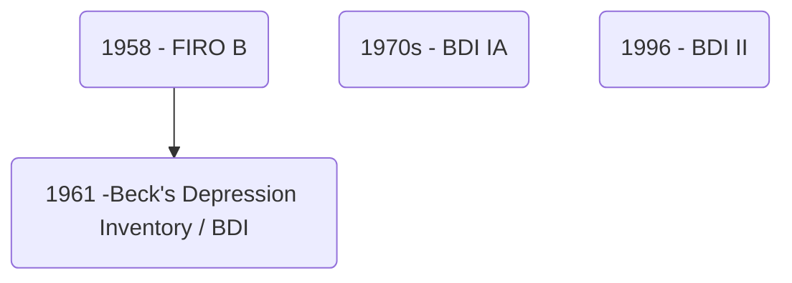

---
title: "Beck's Depression Inventory"
date: 2023-04-04
tags: ['college','psychology','psychpracs']
---

made by [[Aaron T Beck]]

published in 1961

## Introduction
21-item, self-report rating inventory 
**measures** characteristic attitudes and symptoms of depression
mood, pessimism, sense of failure, self-dissatisfaction, guilt, punishment, self-dislike, self-accusation, suicidal ideas, crying, irritability, social withdrawal, indecisiveness, body image change, work difficulty, insomnia, fatigability, loss of appetite, weight loss, somatic preoccupation, and loss of libido.

one of the most widely used psychometric tests

### Versions 
**BDI** - original version 1961; four responses; last week

**BDI - IA** 1970s revision  - for ease, a and b statements were removed, last two weeks

**BDI II** - 1996 revision, dev in response to DSM IV, past two weeks 
validated against Hamilton Depression Rating, positive correlation 
has high one week retest reliability and internal consistency

## Aim 
To detect and assess symptoms of depression in general population
## Plan
To administer [[Beck's Depression Inventory]] and assess symptoms of examinee
## Procedure
Seat the subject comfortably
Ask them to follow the instructions given on the questionnaire 
## Materials 
Inventory 
Scoring Key
Writing material 
## Interpretation
21+ = depressed

| | |
|---|---|
|0-9 | not depressed |
|10-16 | mildly depressed |
|17-29 | moderately depressed |
| 30-63 | severely depressed |

## Instructions 
"This questionnaire has a questions which have multiple statements. Read each statement correctly and select the one that describes you best and circle the number next to it. Be sure to read all the statements in each group before selecting an option"

## Precautions
- make sure instructions are clear 
- make sure subject reads all options 
- 
## Individual Discussion

## Group Discussion

## Conclusion

## Application Value
- used to measure depression in general population 
- used in clincal setup

---

