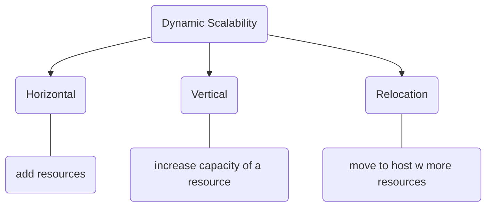

## Components of Dynamic Stability 
### Load Balancer
distribute incoming traffic
![[load balancer]]
### Autoscaling
### Elastic Storage
### Containerization
modular 
### Cloud Provider Service

## Types 
- Dynamic Horizontal
- Dynamic Vertical 
- Dynamic Relocation

## Benefits
ability to handle sudden spikes in traffic or demand [^1]

