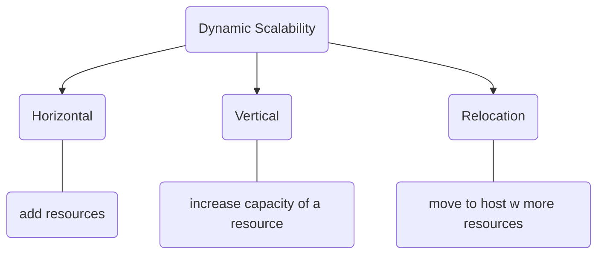

---
{"dg-publish":true,"permalink":"/dynamic-scalability/","title":"Dynamic Stability","tags":["cloudcomputing"],"created":"2023-03-21","updated":""}
---

## Components of Dynamic Stability 
### Load Balancer
distribute incoming traffic

<a class="markdown-embed-link" href="/load-balancer/" aria-label="Open link"><svg xmlns="http://www.w3.org/2000/svg" width="24" height="24" viewBox="0 0 24 24" fill="none" stroke="currentColor" stroke-width="2" stroke-linecap="round" stroke-linejoin="round" class="svg-icon lucide-link"><path d="M10 13a5 5 0 0 0 7.54.54l3-3a5 5 0 0 0-7.07-7.07l-1.72 1.71"></path><path d="M14 11a5 5 0 0 0-7.54-.54l-3 3a5 5 0 0 0 7.07 7.07l1.71-1.71"></path></svg></a>

***the process of distributing a set of tasks over a set of resources, with the aim of making their overall processing more efficient***

makes sure not overloaded or idle 

a load balancer in cloud computing is a device or program that distributes the workloads and traffic across multiple resources, such as servers, networks, or regions, in a cloud environment

improves the performance, availability, and reliability of cloud applications by optimizing parameters like execution time, response time, and system stability

A load balancer can also scale resources up or down as needed and provide high availability and fault tolerance to handle spikes in traffic or server failures².

In simple terms, a load balancer is like a traffic controller that makes sure that no server gets too busy or too idle in the cloud. It helps to balance the load of the devices and make them work faster and smoother

### Autoscaling
### Elastic Storage
### Containerization
modular 
### Cloud Provider Service

## Types 
- Dynamic Horizontal
- Dynamic Vertical 
- Dynamic Relocation

## Benefits
ability to handle sudden spikes in traffic or demand [^1]

