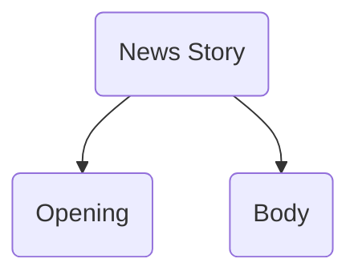

### read every story thrice - 
- familiarization
- once while editing
- to check your work

spelling, punctuation, grammar, expression, accuracy. comprehensibility

## Format of a News Story

### Opening aka *lead* aka introduction
Most vital part of the story
Lead should describe story in a very simple way; 
concise - ~25 words; max - 40 words
eye catching; attention grabbing
should summarise

Example -

> "James Wilson lit a cigarette while soaking his feet in gasoline. He may live"

### Body

should build on the lead
[[inverted pyramid]]
start from big things and then go into details 
If short of words, the story can be cut from the bottom. This is due to the structure used

- self contained - even if paras are deleted at the bottom
- hurried reader to skip over and gain info from just the opening paragraph
- subeditor writes headline 
- might rearrange paras