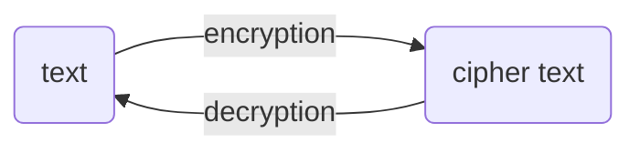

# What is encryption?
Encoding data to ensure that no one but the recipient can access/read
using mathematical algorithms
protecting it from malicious people

**converting plaintext -> ciphertext using mathematical algorithms**, protecting it from malicious users 

### What is cloud encryption?
**converting plaintext -> ciphertext using mathematical algorithms**  ***before*** data is transferred to cloud 

### Decryption
ciphertext -> plaintext
using same key

### Why?
- Even if data is stolen / there is a breach, data cannot be read or accessed without the key 
- protects sensitive data 
- ensures only authorized have access 

## How does Encryption work? 

data -- algorithms + encryption 🔑 --> encrypted data 

## Cloud encryption types 
Data is in either of  two states in the cloud
- transit - data in transit is when data is being moved to or from the cloud  
- rest - data at rest is when it is just being stored 

### Data encryption in transit 
HTTPS Protocol - provides security socket layer (SSL)

### Data encryption at rest 
data encypted so even if someone accesses it, it is worthless jumble of gibberish 

##### multi-factor authentication (MFA)
- something only you know
- something only you have
- something that is part of you (biometric)

---
see also: salting and [[hashing]] textfiles
[[entropy]]
security by obscurity
sha256, md5
aes
