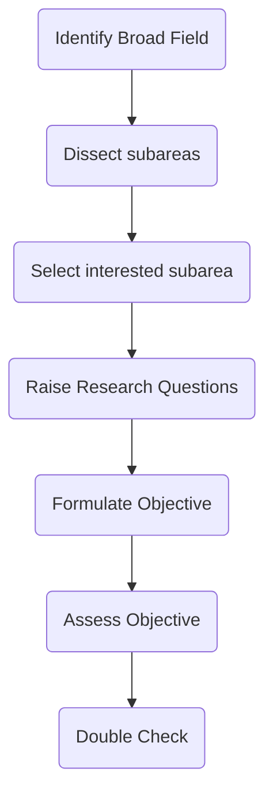
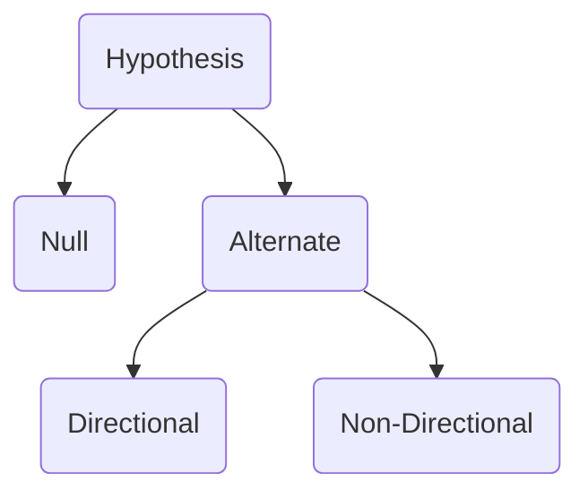

---
{"dg-publish":true,"permalink":"/how-to-write-a-research-proposal/","title":"How To Write a Research Proposal","tags":["researchmethodology","research"],"created":"2023-03-21","updated":""}
---

# 1. Identification of problem
State as a question

<a class="markdown-embed-link" href="/steps-in-formulating-research-problem/" aria-label="Open link"><svg xmlns="http://www.w3.org/2000/svg" width="24" height="24" viewBox="0 0 24 24" fill="none" stroke="currentColor" stroke-width="2" stroke-linecap="round" stroke-linejoin="round" class="svg-icon lucide-link"><path d="M10 13a5 5 0 0 0 7.54.54l3-3a5 5 0 0 0-7.07-7.07l-1.72 1.71"></path><path d="M14 11a5 5 0 0 0-7.54-.54l-3 3a5 5 0 0 0 7.07 7.07l1.71-1.71"></path></svg></a>

Identify broad field -> Dissect the subareas -> selected interested sub-area -> raise research questions -> formulate objective -> Assess Objective -> Double Check

- decide interest area
- break it down to more specific areas
- Raise research questions
  how? impact? what does it do, etc
- Formulate the objective
  root objectives and sub-objectives

# 2. Review of Literature
(remember that your problem is most definitely NOT NOVEL)
Look at existing literature published in a journal 

# 3. **Objective of Study**
To find out factors affecting problem 
gender, location, birth order, age, etc

# 4. **Formulate [[Hypothesis\|Hypothesis]]**
Null or alternate hypothesis 

## Formulating a hypothesis 
based on previous reviews and literature 

Same hypothesis can be stated as a directional or Non-Directional hypothesis. 

Directional - Stating postively/negatively correlated 
Non-Directional - Doesn't state the correlations

For example - "Stress negatively affects wellbeing" is Directional 
"Stress affects wellbeiing" is Non-Directional 
 

**Research Problem -> Should be in the form of an interrogative sense**
Research Objective 
Who is the sample? Factor that into the research objective.
For example - "Does stress affect wellbeing in IT employees"

# 5. Research Design 
## Research Design
Plan, procedure, and structure of how you solve the research problems 

Methods 
1. Research Design 
2. Variables
3. Operational definition of variables - author's definition of concepts is the operational definition and is the one that is used in the experiment 
4. Tool used to measure variables  -                                   
5. Sampling Procedure 
6. Sample description
7. Ethical Consideration
8. Administration Procedure 
9. Statistics

 