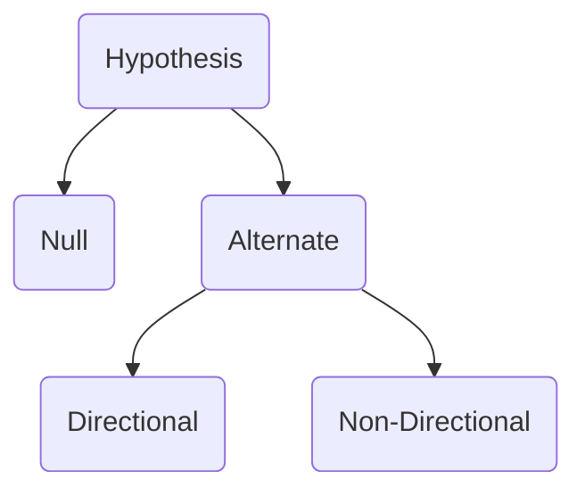

# 1. Identification of problem
State as a question
![[Steps in Formulating Research Problem]]

# 2. Review of Literature
(remember that your problem is most definitely NOT NOVEL)
Look at existing literature published in a journal 

# 3. **Objective of Study**
To find out factors affecting problem 
gender, location, birth order, age, etc

# 4. **Formulate [[Hypothesis]]**
Null or alternate hypothesis 

## Formulating a hypothesis 
based on previous reviews and literature 

Same hypothesis can be stated as a directional or Non-Directional hypothesis. 

Directional - Stating postively/negatively correlated 
Non-Directional - Doesn't state the correlations

For example - "Stress negatively affects wellbeing" is Directional 
"Stress affects wellbeiing" is Non-Directional 
 

**Research Problem -> Should be in the form of an interrogative sense**
Research Objective 
Who is the sample? Factor that into the research objective.
For example - "Does stress affect wellbeing in IT employees"

# 5. Research Design 
## Research Design
Plan, procedure, and structure of how you solve the research problems 

Methods 
1. Research Design 
2. Variables
3. Operational definition of variables - author's definition of concepts is the operational definition and is the one that is used in the experiment 
4. Tool used to measure variables  -                                   
5. Sampling Procedure 
6. Sample description
7. Ethical Consideration
8. Administration Procedure 
9. Statistics

 