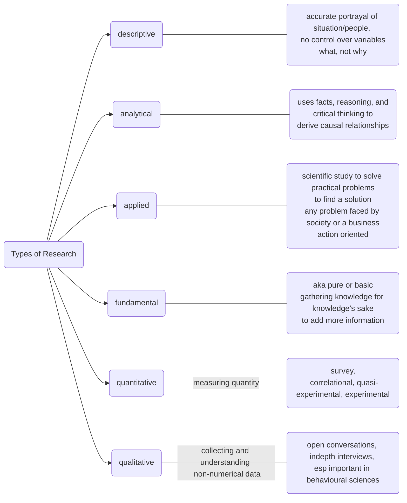
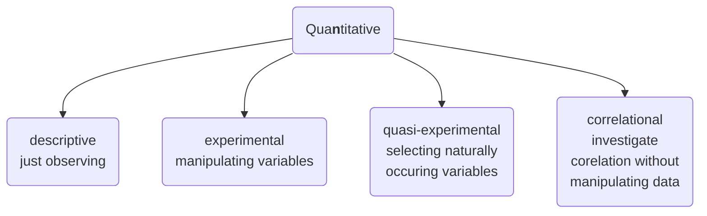
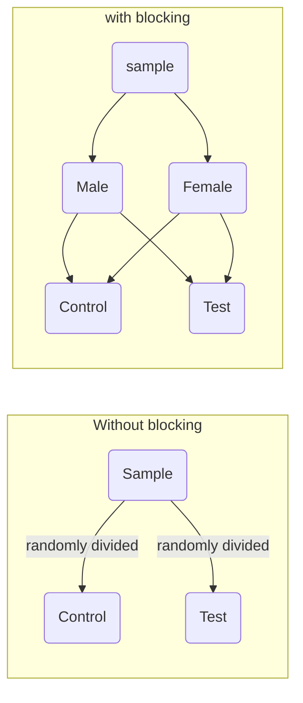
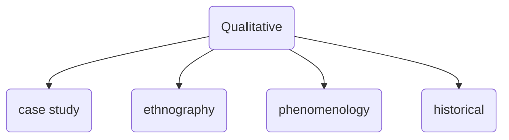

# What is Research? 

is a process of **systematic** **inquiry** that aims to increase the knowledge of a topic or issue

- "movement from known to unknown"
- going from problem to conclusion

- **search for knowledge**
- using current information to add new, unique information to the body of information
- to increase stock of knowledge

Research consists of - 
	defining and redefining **problems**, 
	formulating **hypothesis**; 
	collecting, organizing and evaluating data; 
	making deductions and reaching conclusions; 
	and at last, carefully testing the conclusions

## Characteristics 
- is scientific
- can be applied to any branch of knowledge
- rational
- based on facts, rooted in reality 

- Generalized
- Controlled
- Rigorous
- Empirical 
- Systematic
- [[Reliability and Validity]]
- Credible
- Critical 

## Objectives of Research 
- discover answers using scientific procedures 
- to gain **familiarity** with a phenomenon (exploratory/formulatory)
- to **accurately represent** characteristics of an individual / group (descriptive)
- to determine frequency of a particular event (diagnostic)
- establish causal relationship (hypothesis testing)

answers, to understand, to represent, to diagnose, and to test hypotheses. 

## Motivation for research 
(this is bleh and is included only because it is part of the syllabus)
1. Discover something new
2. Portray actual characteristics of any phenomena
3. Establish causal relationship
4. Confirm existing relationships / validity of the same
5. To get a research degree and consequential benefits (really? "motivation to do it - have to do it")
6. Desire to help society 
7. Desire to gain respect

## Types of Research 

mnemonic: DAAFQQ (pronounced dafuq) 

>[!important] Mnemonic
>DAAFQQ (pronounced dafuq)
>
>Descriptive, Analytical, Applied, Fundamental, Quant, Qual
>
>Descriptive vs Analytical (just studying something or causal link finding)
>Applied vs Fundamental (solving a problem or acquiring new knowledge)
>Quantitative vs Qualitative (measuring numerical data vs non-numerical)

### Other types of research 

- **one-time research** vs **longitudinal** (single time period vs several time periods)
- **field** setting vs **laboratory** setting (control over variables)
- **clinical** / **diagnostic** method (case study, in-depth)
- **historical** 
- **exploratory** vs **formalized**
	(exploratory - a topic/phenomenon that hasn't been explored much; formalized - trying to replicate an experiment, if successful, can be applied to a larger group or universe)

# Quantitative Research

## Types of groups in experimental design

### 1) **Between group difference**
   between two or more groups - for eg, groups based on gender; control and test group; etc 
   for example, when a [[t test]] is used

### 2) **Within group** 
   the differences between the members of the same group 
   
### 3) **Repeated measures design** 
   fewer participants but all of them go through all the conditions
   they serve as their own control
   repeat the experiment 
   crossover studies are an example 
   for eg, two treatments, medicine and placebo. 
   the treatments are randomized and given to the subject, and then it is repeated. So a subject will receive the treatments in a random order, and will receive both types of treatment (as a rule of repeated measures design)  

same as within group test apparently

### 4) Blocking 
   In blocking method, people with a similarity are grouped together. For example, sex. Two blocks, one with male and one with female. From these blocks, the members are assigned control or  test randomly. This ensures **balanced** control and test groups. 

("Block what you can; randomize what you cannot.")

in this, sex is the *blocking factor* 

# Qualitative Research

# Research Methodology vs Research Methods

**Research methodology** is a way to systematically solve the research problem
**all the methods used** by the researcher during the course of studying 
his research problem are termed as research methods

**Grounded Theory** -> relatively large number of participants in a study. It takes an **inductive** (bottom-up) approach, with a focus on letting the data “speak for itself”, **without being influenced** by preexisting theories or the researcher’s preconceptions

#

---

see also: [[Developmental Research - Types and Ethical Issues]]