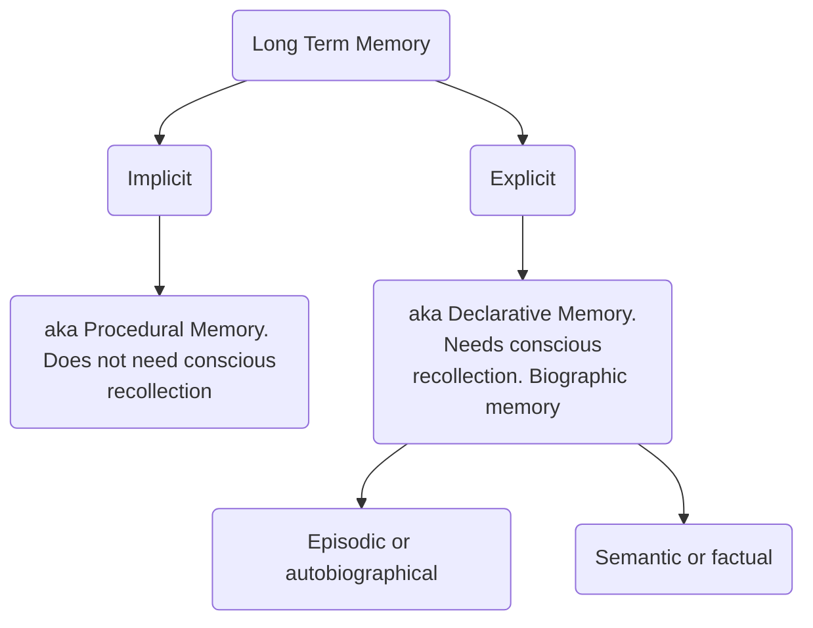
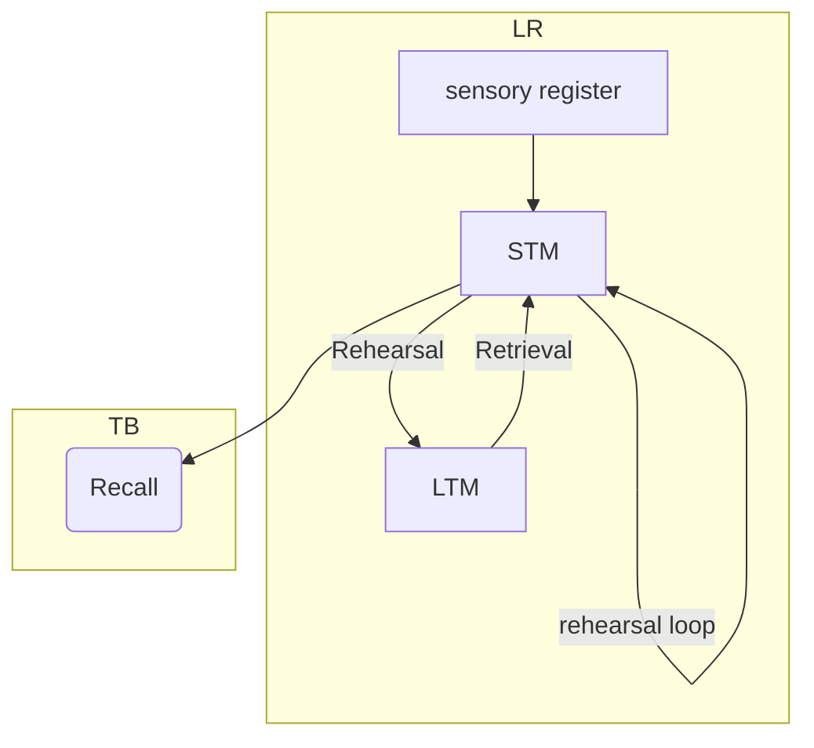

# Learning  
## Definition
relatively durable / lasting change in behaviour that is not the result of maturation, 
acquiring of new knowledge, skills
brought about by <u>experience</u>

## Determinants
1. Needs
2. State
3. Preferred Learning Styles

## Theories of Learning: 
### (a)  Classical Conditioning  
- **Ivan Pavlov**, Russian Physiologist
- Type of conditioning where a neutral (conditioned) stimulus replaces the natural (unconditioned) stimulus, i.e., the conditioned stimulus elicits the same response as the natural stimulus. unconditioned response -> conditioned response
- Bell ringing experiment, saliva, measured

#### Factors - 
a. Extinction
b. Spontaneous Recovery
c. Stimulus Generalization
d. Stimulus Discrimination
e. Higher Order Conditioning

**Watson** -> Little Albert; toy, sound, induce fear

### (b) Operant Conditioning  
- BF Skinner
- Increases chances of particular behaviour by **reinforcement**
- voluntary

- Skinner Box

Types of Reinforcement - 
a. Positive  -  adding stimuli causes rate ^
b. Negative - removing stimuli causes the rate ^
c. Primary - Natural, aids survival
d. Secondary - Learnt/reinforced

Schedules of reinforcement 
a. Continuous - reinforced every time
b. Partial - not every time 

Partial reinforcement is of 4 types ->
1. Fixed-interval schedules: Reinforcing after a specific period of time 
2. Fixed-ratio schedules: Reinforcing after a specific number of responses 
3. Variable-interval schedules: Reinforcing after an unpredictable period of time
4. Variable-ratio schedules: Reinforcing after an unpredictable number of responses

**Punishment**
- DECREASE chances of behaviour
Positive Punishment
Negative Punishment

==**classical conditioning depends on developing associations** whereas **operant conditioning depends on consequences**==

### Law of Effect
Edward Thorndike 
Cats
any behavior that is followed by pleasant consequences = increase behaviour
will stop when consequences stop 

### (c) Insight learning 
- A ha! moment
- perceptual reorganization after few trials
- sudden realization of solution

### (d) Observational/Social Learning
Bandura's Bobo Doll experiment
We observe and learn from others' experience not just ours 

# Memory  
## Definition
Memory = encode, store and retrieve info 
to organize and store information, ready for retrieval when needed

## Memory process
Encode -> Storage -> Retrieval

## Memory Models: 
### Atkinson and Shiffrin model, 
###  Neural Network Models

## Types of Memory – 
### Sensory, 
### STM /Working
### Long Term

## Rehearsal 
- Maintenance Rehearsal / Rote Learning
- Elaborative Rehearsal -> Meaningful; remember for longer

## Memory Enhancing Strategies
- Mnemonics 
- Chunking
- Rehearsal

# FORGETTING:  

Defn - Forgetting is the loss or change in information that was previously stored in short-term or long-term memory. It can occur suddenly or it can occur gradually

## Reasons for Forgetting /Theories of forgetting: 
### Trace decay theory,
memory trace = neural pathway; strengthens with use, fades with disuse | Ebbinghaus Forgetting Curve
### Encoding failure theory 
wasn't encoded properly, fault in first stage
### Displacement theory
loss in short term memory; when new info comes in old is lost
### Retrieval-failure theory,  
tip of the tongue effect, memory is there but diff w recall due to lack of retrieval cues. 
#### Retrieval cues - 
	  - state-dependent
	  - context-dependent
	  - semantic

### Interference theory.
1. **proactive** - new memories are prevented by old memories 
	e.g. writing old year instead of current year 
2. **retroactive** - old memories are altered by new ones
	e.g. Learning a new language and using that with old language

--- 

see also: 
[[../Learning and Memory]]
[[Flashcards]]
[[Zettelkasten]]
