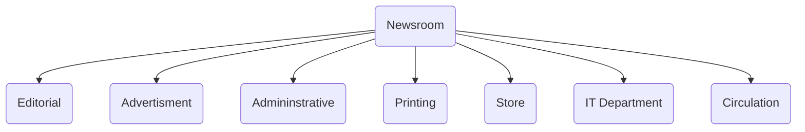

# What is a Newsroom?

Newsroom is a **central workspace** in a **media house** where editors, news reporters, directors, and producers come together. 

**Central part of the news agency**

Different professionals all come together 

aka City Room 

**Selection of news, editing of news, desktop publishing, designing, all take place here** 

# Structure / Elements of a Newsroom
Newsrooms have many wings or departments. 

Each department has its own function but they work in tandem. 

# Functions of a Newsroom 

A place for all the professionals to come together and work. Work as a team. Everything has to go hand in hand, because everything has to fit neatly into the newspaper. The length of articles, the number of articles, the advertisments, everything. Also accomodates last minute changes

## **News gathering**
- **Reporters** go out and look for news; their specific [[Beat]]
- **Correspondents** giving news from other places  and [[Stringers]] 
- Journalists have sources. Hence the "according to reliable sources"
- many beats; crime, sports, entertainment, etc
- expertise in their specific fields
- field reporters, spot covering, quick gather info that is newsworthy
- submitted to newsrooms

## **Selection of news**
  - For example, on business page, if the newshouse has 50 articles, they can't publish all of it.  -> NSE and BSE (stocks) gets the most importance - So selection of news, **prioritizing**
  - **Gatekeepers** select news. Reporters get multiple news, gatekeepers select news articles based on their "newsworthiness"
  - Select or reject news 

## **Editing**
- Word count / article length   
- Proofread
- presentation 
- fixes and makes raw text better
- News selection
- objectivity
- arrange accd to inverted pyramid
- determine news value (importance)
- aren't answerable to reporters
- gatekeeping continues - filtering news story, removing stories that they feel is unimportant

## **Page Designing**
  - alignment
  - should be able to distinguish bw parts 
  - no overlap 
  - Desktop publishing 
  - layout  
  - themes during festivals
  - gutter space
  - images, logos
  - ads, typography

## **Advertisement**
deals with advertisements
types of ads: 
	classified ads
	local
	national
	real estate ads
	law ads
	display ads
	Advertorial (ads + information)

## **Printing Press**
- Production aspects
- installation and maintenance of machines
- compiling data -> newspaper format -> paper
- printing plate prep, printing cutting folding

# Structure of Newsrooms

![[Editorial Structure of Newsroom and Roles]]

---

reference - 
IGNOU's MJM-026 Print Media material
https://egyankosh.ac.in/handle/123456789/59400

