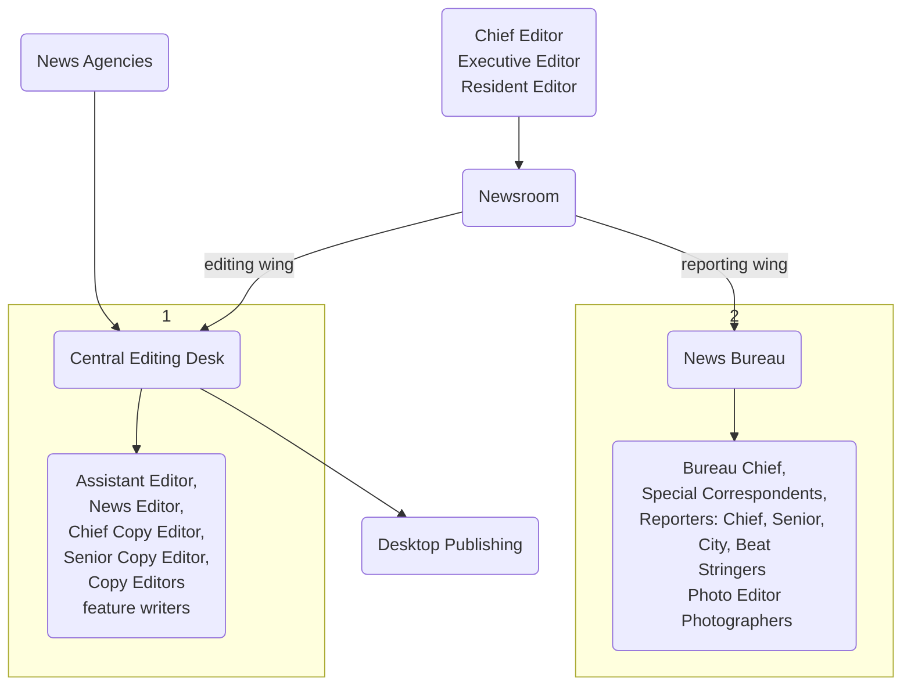

---
{"dg-publish":true,"permalink":"/newsrooms-and-their-functions/","title":"Newsroom and their functions","tags":["journalism"],"created":"2023-04-20","updated":""}
---

# What is a Newsroom?

Newsroom is a **central workspace** in a **media house** where editors, news reporters, directors, and producers come together. 

**Central part of the news agency**

Different professionals all come together 

aka City Room 

**Selection of news, editing of news, desktop publishing, designing, all take place here** 

# Structure / Elements of a Newsroom
Newsrooms have many wings or departments. 

Each department has its own function but they work in tandem. 

# Functions of a Newsroom 

A place for all the professionals to come together and work. Work as a team. Everything has to go hand in hand, because everything has to fit neatly into the newspaper. The length of articles, the number of articles, the advertisments, everything. Also accomodates last minute changes

## **News gathering**
- **Reporters** go out and look for news; their specific [[Beat\|Beat]]
- **Correspondents** giving news from other places  and [[Stringers\|Stringers]] 
- Journalists have sources. Hence the "according to reliable sources"
- many beats; crime, sports, entertainment, etc
- expertise in their specific fields
- field reporters, spot covering, quick gather info that is newsworthy
- submitted to newsrooms

## **Selection of news**
  - For example, on business page, if the newshouse has 50 articles, they can't publish all of it.  -> NSE and BSE (stocks) gets the most importance - So selection of news, **prioritizing**
  - **Gatekeepers** select news. Reporters get multiple news, gatekeepers select news articles based on their "newsworthiness"
  - Select or reject news 

## **Editing**
- Word count / article length   
- Proofread
- presentation 
- fixes and makes raw text better
- News selection
- objectivity
- arrange accd to inverted pyramid
- determine news value (importance)
- aren't answerable to reporters
- gatekeeping continues - filtering news story, removing stories that they feel is unimportant

## **Page Designing**
  - alignment
  - should be able to distinguish bw parts 
  - no overlap 
  - Desktop publishing 
  - layout  
  - themes during festivals
  - gutter space
  - images, logos
  - ads, typography

## **Advertisement**
deals with advertisements
types of ads: 
	classified ads
	local
	national
	real estate ads
	law ads
	display ads
	Advertorial (ads + information)

## **Printing Press**
- Production aspects
- installation and maintenance of machines
- compiling data -> newspaper format -> paper
- printing plate prep, printing cutting folding

# Structure of Newsrooms

<a class="markdown-embed-link" href="/editorial-structure-of-newsroom-and-roles/" aria-label="Open link"><svg xmlns="http://www.w3.org/2000/svg" width="24" height="24" viewBox="0 0 24 24" fill="none" stroke="currentColor" stroke-width="2" stroke-linecap="round" stroke-linejoin="round" class="svg-icon lucide-link"><path d="M10 13a5 5 0 0 0 7.54.54l3-3a5 5 0 0 0-7.07-7.07l-1.72 1.71"></path><path d="M14 11a5 5 0 0 0-7.54-.54l-3 3a5 5 0 0 0 7.07 7.07l1.71-1.71"></path></svg></a>

# Structure of Newsrooms 
[[Newsrooms and their functions\|Newsrooms]] can have various wings depending on the size of the newspaper. They can be divided into editing, reporting, and mechanical wing.

# Roles (News Desk/Central Editing Desk)
## Editor / Chief Editor / Editor-in-Chief
heads a newspaper
supervises and controls all newsrooms
designation depends on size and structure of newsroom
responsible for the **editorial policy**
looks after its execution (in consultation with Resident and Executive Editors)
plans growth
responsible for everything, **especially the editorial page** (aka voice of the paper)
makes editorial and special comments on contemporary issues
content and presentation of the newspaper = **editor's vision**

## Executive Editor
Executes the vision of the editor in chief
takes part in all initiatives taken by editor-in-chief 
gives suggestions to junior staff in absence of editor-in-chief
up to date with activities of multi-edition newspapers 

## Resident Editor
in multi-edition newspapers, newspapers are published from different towns and cities 
person who heads a particular edition = resident editor

Large papers have many editions. For eg ToI originates from Mumbai but has lots of editions - Bangalore, New Delhi, etc

Resident Editors are extended arms of the chief editor who implements newspaper's policies

## Assistant Editor
assists chief editor and performs the duties assigned by the chief editor
may write an editorial and look after the feature page + supplements
Closely associated w Chief Editor

## News Editor
decides the selection and rejection of news items
assigns the items on various pages
gives a fresh treatment or angle to the news
allocates page 
decides all of this on the worthiness of the news story
in close contact w news placement and page designing; and news wing and reporting wing
supervises colleagues
co-ordinates 
knows policies and implents them under the guidance of editor

smaller newsrooms might not have a news editor; in that case, chief sub fills the role 

## Chief Sub Editor / Chief Copy Editor
Distributes news items to sub editors 
coordinates with news and reporting wing for better  
coverage and also consults with the advertisement and circulation wing
In absence of News Editor, play the role 

# Roles (News Bureau)
## Bureau Chief 
leads central bureau; 
assigns duties;
co-ordinates with news wing; 
reports to news editor / chief sub-editor

## Special Correspondents 
(cover national and international news)
senior-most, most experienced members

## Chief Reporter 
covers major events in the city or district 
assigns duties to reporters and guides them
plans special stories
builds rapport with politicians and officials
builds connections with information sources

## Senior Reporters
covers major happenings
assists bureau chief
takes over the role of bureau chief in case of their absence 

## Reporters
have a group of reporters 
might have a specific [[Beat\|Beat]]
supervise by bureau chief 

## 

<a class="markdown-embed-link" href="/stringers/" aria-label="Open link"><svg xmlns="http://www.w3.org/2000/svg" width="24" height="24" viewBox="0 0 24 24" fill="none" stroke="currentColor" stroke-width="2" stroke-linecap="round" stroke-linejoin="round" class="svg-icon lucide-link"><path d="M10 13a5 5 0 0 0 7.54.54l3-3a5 5 0 0 0-7.07-7.07l-1.72 1.71"></path><path d="M14 11a5 5 0 0 0-7.54-.54l-3 3a5 5 0 0 0 7.07 7.07l1.71-1.71"></path></svg></a>

Freelancers who have a working relationship with a news/media agency but are paid per work instead of a regular salary. 

Think Peter Parker submitting photos to the Daily Bugle

# Photography Wing
## Photo Editor
## Chief Photographer
## Photographers

# Other elements
 They may also have - 

---

reference - 
IGNOU's MJM-026 Print Media material
https://egyankosh.ac.in/handle/123456789/59400

---

reference - 
IGNOU's MJM-026 Print Media material
https://egyankosh.ac.in/handle/123456789/59400

