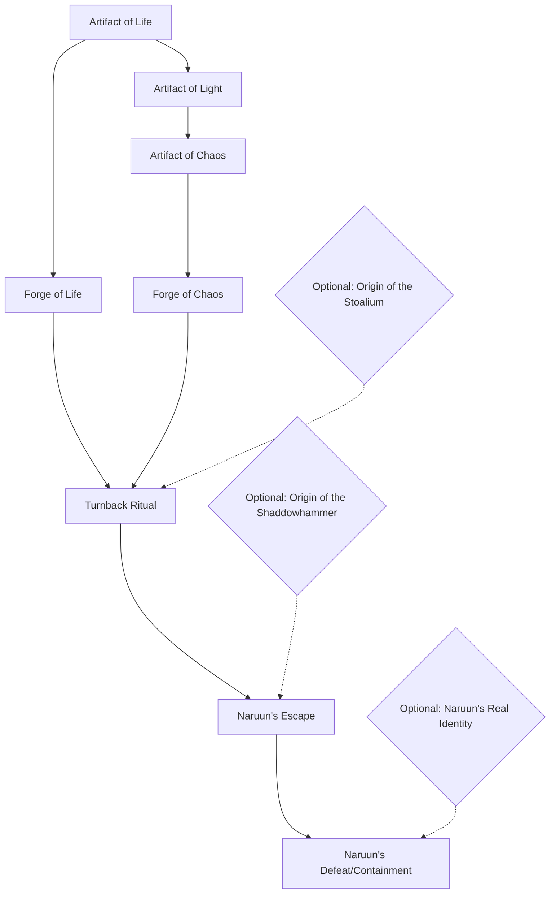

---
{"dg-publish":true,"permalink":"/promises-of-victory/adventuring/structure-of-the-campain/","title":"Structure of the Campain","noteIcon":"Meta","created":"","updated":""}
---

# Introduction

Promises of Victory is a Campain set in [[Promises of Victory/Worldbuilding/Regions/The Basin\|The Basin]], a Region currently in war, lead by the **[[Promises of Victory/Worldbuilding/Factions/League of Arathor/League of Arathor\|League of Arathor]]** and the **[[Promises of Victory/Worldbuilding/Factions/Defilers/Defilers\|Defilers]]**.

In the Background [[Promises of Victory/Worldbuilding/Factions/Shaddowhammer/The Shaddowhammer\|The Shaddowhammer]] clan is preparing a ritual that will return the old God [[Promises of Victory/Worldbuilding/Factions/Naruun/Naruun\|Naruun]], who is sealed deep underground in the middle of [[Promises of Victory/Worldbuilding/Regions/The Basin\|The Basin]]. The Cult sees the old God as the true god of death and the ritual will revive every lost soul in [[Promises of Victory/Worldbuilding/Regions/The Basin\|The Basin]].

To do that, [[Promises of Victory/Worldbuilding/Factions/Shaddowhammer/The Shaddowhammer\|The Shaddowhammer]] are in the process of collecting 3 Artifacts that were used to seal the old god.

- The **Heart of the forrest**, the [[Promises of Victory/General/Storys/Artifact of Life\|Artifact of Life]] which they try to get by Invading city of [[Promises of Victory/Worldbuilding/Regions/Todo/Sturmklau\|Sturmklau]] 
- The **Tear of the Archdevil**, the [[Promises of Victory/General/Storys/Artifact of Chaos\|Artifact of Chaos]] which the players are bringing into [[Promises of Victory/Worldbuilding/Regions/The Basin\|The Basin]] to be delivered to [[Promises of Victory/Worldbuilding/Factions/Unaffiliated/Dr Phalando\|Dr Phalando]] 
- **Sundawn**, the [[Promises of Victory/General/Storys/Artifact of Light\|Artifact of Light]] which they already have since their Leader [[Promises of Victory/Worldbuilding/Factions/Shaddowhammer/Volar\|Volar]] is a Fallen Paladin of [[Promises of Victory/Worldbuilding/Regions/🏰Lichtachte/Lichtachte\|Lichtachte]] 

They need to bring the Artifacts to 3 different ancient arcane machineries called [[Promises of Victory/General/Storys/Titan Forges\|Titan Forges]] and fuel the Jail with a vast amount of soul energy.

To activate the Ritual the call the [[Promises of Victory/Worldbuilding/Factions/Shaddowhammer/Turnback\|Turnback]] they need a gigantic amount of  [[Promises of Victory/General/Storys/Souls of the Dead\|Souls of the Dead]] that they have been gathering on the Battlefields and funneling into the Central City of [[Promises of Victory/Worldbuilding/Regions/🏰Edschmied/Edschmied\|Edschmied]] 

The party has to find the artifacts to maybe alter the ritual and kill [[Promises of Victory/Worldbuilding/Factions/Naruun/Naruun\|Naruun]] for good, while not also falling to the false promisses of the old god. This is a Major Plot twist. The Party starts by searching for the Artifacts and thinks bringing them to the Forges harms the [[Promises of Victory/Worldbuilding/Factions/Shaddowhammer/The Shaddowhammer\|Shaddowhammer]].

# Major Plot Threads

Those are the Threads the Player need to solve:

### [[Promises of Victory/General/Storys/Artifact of Life\|Artifact of Life]]
The City of [[Promises of Victory/Worldbuilding/Regions/Todo/Sturmklau\|Sturmklau]] is attacked and [[Promises of Victory/Worldbuilding/Factions/Shaddowhammer/The Shaddowhammer\|The Shaddowhammer]] tries to steal the Heart of the Forrest.
When the player gather the [[Promises of Victory/General/Storys/Artifact of Life\|Artifact of Life]] [[Promises of Victory/Worldbuilding/Factions/Naruun/Naruun\|Naruun]] will try to trick them into bringing it into the [[Promises of Victory/Worldbuilding/Regions/Todo/Forge of Life\|Forge of Life]], which is Located beneath the hideout of the [[Promises of Victory/Bestiary/Subclasses/Cult of the Gifted Ones (Class)\|Cult of the Gifted Ones (Class)]] next to [[Promises of Victory/Worldbuilding/Regions/Todo/Maerhof\|Maerhof]].

### [[Promises of Victory/General/Storys/Artifact of Light\|Artifact of Light]]
The [[Promises of Victory/General/Storys/Artifact of Light\|Artifact of Light]] is already in posession of [[Promises of Victory/Worldbuilding/Factions/Shaddowhammer/The Shaddowhammer\|The Shaddowhammer]], which is unknown to the Players. 
[[Promises of Victory/Worldbuilding/Factions/Shaddowhammer/The Shaddowhammer\|The Shaddowhammer]] does not know the Location of the [[Promises of Victory/Worldbuilding/Regions/Todo/Forge of Light\|Forge of Light]] which is located in the Mines of Torar. A Recent excavation Site in the Mines uncovered this Secret, but the Information is kept shut by the Academy of  [[Promises of Victory/Worldbuilding/Factions/The Triad/The Triad\|The Triad]].
In thinking they need to gather the Artifacts the party can plan a Heist on the Cathedral of [[Promises of Victory/Worldbuilding/Regions/🏰Lichtachte/Lichtachte\|Lichtachte]] 

### [[Promises of Victory/General/Storys/Artifact of Chaos\|Artifact of Chaos]]
Coming into Contact with followers of the [[Promises of Victory/Worldbuilding/Factions/Shaddowhammer/The Shaddowhammer\|Shaddowhammer]] the party gets Hunted for the Artifact.
[[Promises of Victory/Worldbuilding/Factions/Naruun/Naruun\|Naruun]] will try to trick the Players into bringing the Artifact into the [[Promises of Victory/Worldbuilding/Regions/Todo/Forge of Chaos\|Forge of Chaos]]. 

### [[Promises of Victory/General/Storys/Souls of the Dead\|Souls of the Dead]] 
For the last 20 Years [[Promises of Victory/Worldbuilding/Factions/Cult of the Gifted/The Cult of the Gifted\|The Cult of the Gifted]] are building an Arcane Machine out of [[Promises of Victory/Worldbuilding/Factions/Naruun/Stoalium\|Stoalium]] that they think will lead to the Resurrection of all fallen People in [[Promises of Victory/Worldbuilding/Regions/The Basin\|The Basin]]. The [[Promises of Victory/Worldbuilding/Factions/The Triad/The Triad\|The Triad]] has been hiding the many shipments of [[Promises of Victory/Worldbuilding/Factions/Naruun/Stoalium\|Stoalium]] towards the Ritual Site. The [[Promises of Victory/Worldbuilding/Factions/Shaddowhammer/The Shaddowhammer\|Shaddowhammer]] hast been gathering Energy from the Fallen Soldiers in [[Promises of Victory/Worldbuilding/Regions/The Basin\|The Basin]] to fuel the Ritual.  

### The [[Promises of Victory/General/Storys/Final Sacrifice\|Final Sacrifice]]
When all Artifacts are brought to their respective Forges and the Seals are broken.  The [[Promises of Victory/Worldbuilding/Factions/Shaddowhammer/Turnback\|Turnback]] ritual will begin, leading to the release of [[Promises of Victory/Worldbuilding/Factions/Naruun/Naruun\|Naruun]], the old god of false promises. [[Promises of Victory/Worldbuilding/Factions/Cult of the Gifted/The Cult of the Gifted\|The Cult of the Gifted]] Ones, believing they will revive every lost soul in [[Promises of Victory/Worldbuilding/Regions/The Basin\|The Basin]], will unknowingly bring about [[Promises of Victory/Worldbuilding/Factions/Naruun/Naruun\|Naruun]]'s return and potential domination over the world.
As the ritual commences, a colossal [[Promises of Victory/Worldbuilding/Factions/Naruun/Stoalium\|Stoalium]] contraption built by the Cult beneath the city of [[Promises of Victory/Worldbuilding/Regions/🏰Edschmied/Edschmied\|Edschmied]] will start to channel the gathered soul' energy into each of the three forges. 
It takes one week for the Prison of [[Promises of Victory/Worldbuilding/Factions/Naruun/Naruun\|Naruun]] to break.   
The party must race against time to not only prevent [[Promises of Victory/Worldbuilding/Factions/Naruun/Naruun\|Naruun]]'s escape but also find a way to destroy or contain him for good.

# Optional Threads

Those are the Plot Threads the Players can optionally solve: 

## Origin of [[Promises of Victory/Worldbuilding/Factions/Shaddowhammer/The Shaddowhammer\|The Shaddowhammer]]

The party can learn about the and Origin of [[Promises of Victory/Worldbuilding/Factions/Shaddowhammer/The Shaddowhammer\|The Shaddowhammer]] and [[Promises of Victory/Worldbuilding/Factions/Shaddowhammer/Volar\|Volar]], their founder.

[[Promises of Victory/Worldbuilding/Factions/Shaddowhammer/Volar\|Volar]] was once a Paladin in the ranks of the [[Promises of Victory/Worldbuilding/Factions/League of Arathor/League of Arathor\|League of Arathor]].
The [[Promises of Victory/Worldbuilding/Factions/LPF/League of Paranormal Researchers\|League of Paranormal Researchers]] secretly killed his daughter to find out more about the [[Promises of Victory/Worldbuilding/Factions/Nosem/Nosem\|Nosem]].
This led to him being seduced by the Fulfiller, a hag that wants to revive [[Promises of Victory/Worldbuilding/Factions/Naruun/Naruun\|Naruun]].

She promises him [[Promises of Victory/Worldbuilding/Factions/Naruun/Naruun\|Naruun]] will be able to revive his daughter, but in reality he only leads to the freeing of the old God.
[[Promises of Victory/Worldbuilding/Factions/Shaddowhammer/Volar\|Volar]] starts with joining [[Promises of Victory/Worldbuilding/Factions/Cult of the Gifted/Iraia\|Iraia]] and [[Promises of Victory/Worldbuilding/Factions/Cult of the Gifted/Edard Combell\|Edard Combell]] to found the [[Promises of Victory/Bestiary/Subclasses/Cult of the Gifted Ones (Class)\|Cult of the Gifted Ones (Class)]] 

The Party can learn, that [[Promises of Victory/Worldbuilding/Factions/Shaddowhammer/Volar\|Volar]] is actualy blinded by his grief and maybe can stop him by confronting him with the truth.

If the party manages to save [[Promises of Victory/Worldbuilding/Factions/Shaddowhammer/Volar\|Volar]] from the hag that seduced him, he will join the party and show them how to kill [[Promises of Victory/Worldbuilding/Factions/Naruun/Naruun\|Naruun]] for good.
With the [[Promises of Victory/Worldbuilding/Factions/Naruun/Stoalium\|Stoalium]] metal and the power of a Titanforge they can sund the energy of a soulstone into [[Promises of Victory/Worldbuilding/Factions/Naruun/Naruun\|Naruun]] and bind him to the world.

## Origin of the [[Promises of Victory/Worldbuilding/Factions/Naruun/Stoalium\|Stoalium]]

All over the lands of [[Promises of Victory/Worldbuilding/Regions/The Basin\|The Basin]] you can find round tubical Caves that go deeper and deeper into the earth. In those Caves you can find a metal called [[Promises of Victory/Worldbuilding/Factions/Naruun/Stoalium\|Stoalium]] that sits bare in the center of the cave and is anchored through little tendrils to the wall of the cave.

In short, who controls the [[Promises of Victory/Worldbuilding/Factions/Naruun/Stoalium\|Stoalium]] supplies, has the upper hand in the Battle for [[Promises of Victory/Worldbuilding/Regions/The Basin\|The Basin]]. Because of that, for both sides, Controlling the [[Promises of Victory/Worldbuilding/Regions/Todo/Mines of Torrar\|Mines of Torrar]], [[Promises of Victory/Worldbuilding/Regions/🏰Herbstbog/Herbstbog\|Herbstbog]] and [[Promises of Victory/Worldbuilding/Regions/🏰Edschmied/Edschmied\|Edschmied]] is the Key to Wining the war.

In reality [[Promises of Victory/Worldbuilding/Factions/Naruun/Stoalium\|Stoalium]] is the remans of the nerves of [[Promises of Victory/Worldbuilding/Factions/Naruun/Naruun\|Naruun]] and the power bolstering properties wear off at the most Ciritcal Moment.
This leads to the endless war going back and fourth. With one party pusshing right to the enemys gate, but then loosing by a sudden turn of events.

The party can learn, that the [[Promises of Victory/Worldbuilding/Factions/Naruun/Stoalium\|Stoalium]] is the reason for this unending loop, that they can use to end the conflict once and for all.

## Naruuns Real Identity
[[Promises of Victory/Worldbuilding/Factions/Fulfiller/The Fulfiller\|The Fulfiller]] is the key of resolving the secret of Naruuns real identify, by investigating the Hag and the  [[Promises of Victory/Worldbuilding/Regions/Todo/Fulfiller's Market\|Fulfiller's Market]] the players can uncover the true nature of [[Promises of Victory/Worldbuilding/Factions/Naruun/Naruun\|Naruun]] as the old god of false promises. By learning his true identity, they can devise a plan to expose him and his manipulations to the people of [[Promises of Victory/Worldbuilding/Regions/The Basin\|The Basin]], weakening his power and influence over them.

Through their investigation, the party can discover that [[Promises of Victory/Worldbuilding/Factions/Naruun/Naruun\|Naruun]] has been feeding on the despair and unfulfilled desires of the people in [[Promises of Victory/Worldbuilding/Regions/The Basin\|The Basin]], using their suffering to increase his power. The continuous war, fueled by the properties of [[Promises of Victory/Worldbuilding/Factions/Naruun/Stoalium\|Stoalium]], has provided Naruun with an endless supply of misery.

Armed with this knowledge, the party can seek allies among both the [[Promises of Victory/Worldbuilding/Factions/League of Arathor/League of Arathor\|League of Arathor]] and the [[Promises of Victory/Worldbuilding/Factions/Defilers/Defilers\|Defilers]], uniting them against a common enemy. By exposing Naruun's deception and manipulation, they can rally their forces against him and work together to find a way to destroy or contain him for good.

As they work together, new alliances will form between former enemies, leading to a more peaceful and united future for [[Promises of Victory/Worldbuilding/Regions/The Basin\|The Basin]]. However, they must remain vigilant against any remaining followers of Naruun who continue to spread his false promises.

# Flowchart
Detailing the Link between the Major Plot Points and how the Optional Plots influence them  
