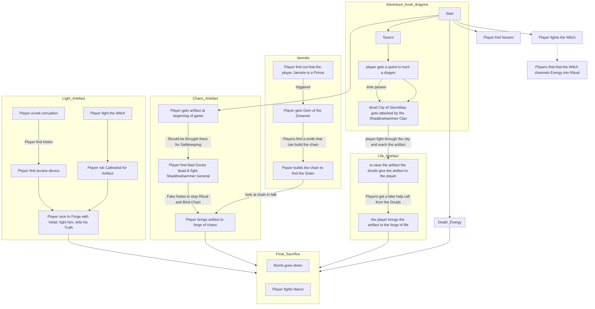

---
{"dg-publish":true,"permalink":"/promises-of-victory/general/storys/storys/","title":"Storys","noteIcon":"Meta","created":"","updated":""}
---

- [[Promises of Victory/General/Storys/Artifact of Chaos\|Artifact of Chaos]]
- [[Promises of Victory/General/Storys/Artifact of Life\|Artifact of Life]]
- [[Promises of Victory/General/Storys/Artifact of Light\|Artifact of Light]]
- [[Promises of Victory/General/Storys/Final Sacrifice\|Final Sacrifice]]
- [[Promises of Victory/General/Storys/Souls of the Dead\|Souls of the Dead]]
- [[Promises of Victory/General/Storys/Titan Forges\|Titan Forges]]

This is BS and outdated ...

