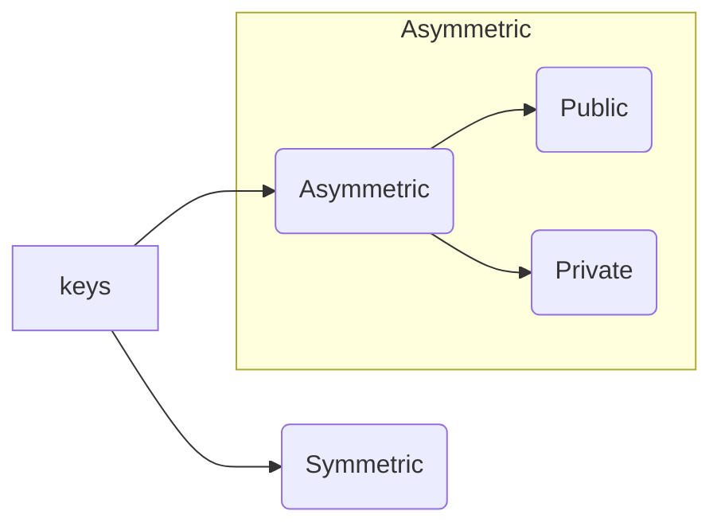

# How to trust a cloud? 

Each and every security process, layer or software must implement and cover the CIA triad 
[[Cloud - Basic Terms of security]]
## CIA
**C**onfiditentiality - between two parties 
**I**ntegrity - content is not changed, not tampered; not altered 
**A**vailabilty - systems available 

## More parameters
Authentication - confirm identity 
Authorization - process of granting access
Non-Repudiation - the intended endpoint has sent the message and cannot deny it later 

---
To provide these, PKI is used

# Public Key Infrastructure 
A framework consisting of security policies, communication protocols, procedures, etc

uses a hybrid of [[Asymmetric vs Symmetric Key|symmetric and assymetric key]]

enable secure and trusted communication between different entities within as well as outside the organization. 

## Components of PKI 

**CA** Certificate Authority
	 entity issues certificates for requests received
	 
RA Registration
	entity performs the background checking process on the requests received from end point entities 

**CRL** Certification Revoking List
	list of the certificates which are no longer valid to be trusted 

End Point Entities
	entities make requests for the certificates in order to prove their identity and gain trust over the Internet

**CR** Certificates Repository
	contains a list of issued certificates which the end point entities can retrieve in order to verify the corresponding server

---