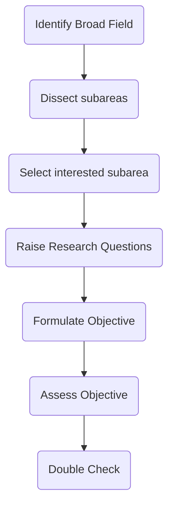

---
{"dg-publish":true,"permalink":"/research-problem-and-sources/","title":"Research Problem and Sources","tags":["research","researchmethodology"],"created":"2023-04-18","updated":""}
---

# What is a research problem?

A research problem is a question that the research hopes to answer 
**specific issue or gap in existing knowledge**

posed in form of a question 
(contrast with hypothesis which is a tentative statement, an assumption)

# Why is research problem required? 
- it acts as **introduction** to the reader 
- provides framework 
- contextualizes 

# Characteristics 
1. Must be important or necessary
2. based on factual evidence (NOT HYPOTHETICAL)
3. Must be relevant 
4. suggests a meaningful method of resting hypothesis 

<a class="markdown-embed-link" href="/steps-in-formulating-research-problem/" aria-label="Open link"><svg xmlns="http://www.w3.org/2000/svg" width="24" height="24" viewBox="0 0 24 24" fill="none" stroke="currentColor" stroke-width="2" stroke-linecap="round" stroke-linejoin="round" class="svg-icon lucide-link"><path d="M10 13a5 5 0 0 0 7.54.54l3-3a5 5 0 0 0-7.07-7.07l-1.72 1.71"></path><path d="M14 11a5 5 0 0 0-7.54-.54l-3 3a5 5 0 0 0 7.07 7.07l1.71-1.71"></path></svg></a>

Identify broad field -> Dissect the subareas -> selected interested sub-area -> raise research questions -> formulate objective -> Assess Objective -> Double Check

- decide interest area
- break it down to more specific areas
- Raise research questions
  how? impact? what does it do, etc
- Formulate the objective
  root objectives and sub-objectives

# Sources of research problems 
personal and practical experience
critical appraisal of literature
previous research
existing theories
consumer feedback
performance improvement activities
social issues
brainstorming
intuition 
exposure to field
consultations with experts 

