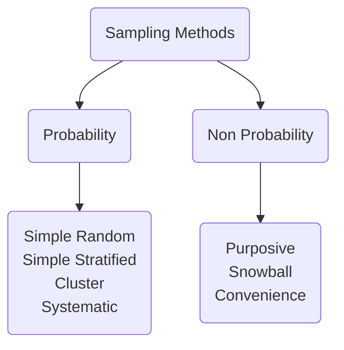

# Sample, Universe, Population

## Sample 
A sub-section of the population 
a **representation** of the population 
**inference** is **generalized**

# Process of Sampling
1. Define the population 
2. Develop [[Sampling Frame]]
3. Select a Samling Method 
4. Determine sample size
5. Execute the sampling process

**Sampling Population**
**Sample**

# Sampling Techniques 
1. Fixed vs sequential 
2. Probability vs non-probability
3. Attributes vs 

### Probability Sampling vs Non-probability Sampling 

| Probability|Non-probability|
|---|---|
| Every element has a chance of being in the sample | not equal chance |
| sample is random | sample is chosen by researcher according to their convenience|
|representative of the population|not representative|

### Simple random 
### Stratified random sampling 
builds up from simple random
**divides** the population into groups depending on characteristic. groups = stratas 
and then random sampling is performed
(Each subject only one strata; different stratas can have different number of subjects)
### Cluster Random Sample 
A cluster is obtained by first dividing the population into randomly chosen sub-groups **(clusters)** 
a random **assortment of clusters** = **the sample** 
in stratified - there is no common characteristic needed
### Systematic Sampling 
Every k th element 
This method simply involves selecting participants **at a set interval**, starting from a **random point**.

 
