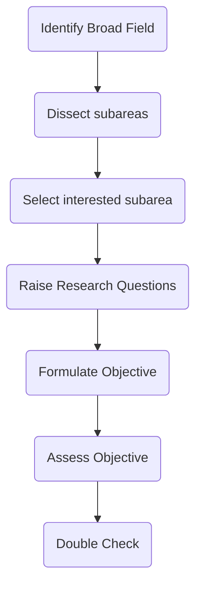

Identify broad field -> Dissect the subareas -> selected interested sub-area -> raise research questions -> formulate objective -> Assess Objective -> Double Check

- decide interest area
- break it down to more specific areas
- Raise research questions
  how? impact? what does it do, etc
- Formulate the objective
  root objectives and sub-objectives

