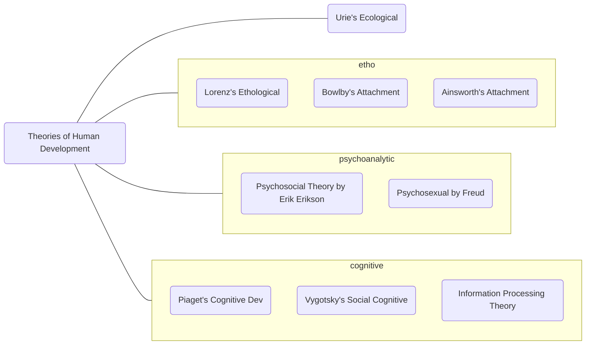

see also: [[Introduction to Life Span Development#Perspectives / Key issues in Lifespan Development|Key issues in Lifespan Development]]

# Psychoanalytic Theories 
focuses on the influence of unconscious
symbolism
early experiences with parents extensively shape development

## Psychosexual Theory by Freud
Freud, through analysis of his patients, began to believe that their problems were the result of early experiences in their life. According to him, our adult personality is determined  by the way we **resolve conflicts between sources of pleasure at each stage** and the  **demands of reality**.

erogenous zones, sexual stages, Oedipus complex, Electra complex  
1. Oral 
2. Anal
3. Phallic
4. Latency
5. Genital

|    Stage    |    Age    |    Erogenous Zone    |    Fixation    |    Description    |
|---|---|---|---|---|
|    Oral    |    Birth   to 1 year    |    Mouth    |    Oral   fixation leads to oral personality, i.e., selfishness, depression, aggression    |    Baby   obtains gratification through mouth; feeding, thumb sucking, biting. All   provide pleasure.     First emotional tie with external world.    |
|    Anal    |    2 - 3;   during potty training    |    Anal   area    |    Result   of conflict arising due to toilet training. Orderliness, miserliness, and   obstinacy     |    Child   gains control over bodily functions of urination and excretion; they gain   pleasure from retaining bowels     |
|    Phallic    |    4 - 6    |    Genital   area    |                 -    |    Understand   gender, become aware of sexuality and sexual relationship bw parents. Oedipus Complex (Boy develops love for his   mother, thinks of father as rival, develops a fear of punishment from father "castration anxiety" . For girls - Electra Complex. Both repress desires and   identify with parent of same gender and adopt gender roles    |
|    Latency    |    7 -   Puberty    |           -    |         |    Physical   growth. Relatively low sexual urges; Repression of sexual instincts. Learns values of family and culture    |
|    Genital    |    Puberty   - Adulthood    |    Genitals    |    Fixation   leads to regression to an earlier stage    |    Last   stage. Learns to deal with opposite sex in   socially and sexually matured   way. Sexual energy directed towards opposite   sex.     |

## Erikson's **Psychosocial** Theory
like Freud's theory, focuses on unconscious. But instead of sexual, focuses on social aspects 
connection, attribution, love, care
### Stages of Erikson's theory

#### 1. Trust vs Mistrust
shapes worldview 
age - 0-1 
negative outlook or positive outlook wrt the world around them

#### 2. Autonomy vs Shame
1 year - 3 year
sense of self, independence

#### 3. Initiative vs Guilt
age - 3-5 
either takes initiative and makes friends, or feels guilty 

#### 4. Industry vs Inferiority 
mastering of knowledge, intellectual skills 
negative outcome = sense of inferiority; incompetent; 
unproductive

#### 5. Identity vs Identity Confusion (or identity diffusion)
10 - 20 / adolescence
finding your self identity
who they are, where they're going in life, their values etc
	failure to answer these - they are confused, negatively affects
	esteem
	
#### 6. Intimacy vs Isolation
Early adulthood, 20s - 30s
Developing intimate relationships
Forming healthy friendships
failure - social isolation

#### 7. Generativity vs Stagnation
40s - 50s, middle adulthood 
Generativity = want to help younger generation
Stagnation = having done nothing to help the younger gen
#### 8. Integrity vs Despair
60+, late adulthood
reflects on past; retrospective
was life spent well? satisfaction
doubt vs gloom, despair 
sad about and unsatisfied about the kind of life they lived 
close to death, how they react to aging and concept of
death???

### Mnemonic for Erikson's Psychosocial Stages
[[Peg Word Mnemonic]]
One is a bun,
Two is a shoe,
Three is a tree,
Four is a door,
Five is a hive,
Six is sticks,
Seven is heaven,
Eight is bait

mnemonic for the goals of each stage: 
**He Will Probably Come Fast, Literally Can't Wait!** 💦

visual aid for mnemonic -> 
Rusted Bun (tRust)
Shoe run over by Shane in his car (Sha(n)me vs autonomy)

# Cognitive Theories

## 1. Piaget
   accd to him, **the way they think, not how much they know, decides their cognitive development**
   children actively construct their understanding of the world 
   four stages of cognitive development
   two processes that the cognitive construction of the world
   - Organization
   - Adaptation
   We organize our experiences and observations
   We adapt to situations and new environmental demands
   
   4 stages
1. Sensorimotor Stage (birth to 2)
	infants construct an understanding of   the world by coordinating sensory experiences with physical, motoric actions—hence the term sensorimotor 
2. Preoperational Stage (2 - 7)
  represent the world with words and images 
3. Concrete Operational Stage (7-11) 
   can now reason logically about concrete events and classify objects into different sets
4. Formal Operational Stage (11+ to adulthood)
   can understand complex abstract concepts

   **SPCF**
   
## 2. Vygotsky's Sociocultural Cognitive Method
emphasizes on **how culture and social interaction** mould cognitive development
child’s development as inseparable from social and cultural activities
importance to social aspects
importance to language
importance of being around skilled adults 
	 [[Zone of Proximal Development]]
   [[Scaffolding]]

## 3. Information processing theory
   No structure or stages; continuous/gradual 
   monitoring, manipulating, strategizing information
   

# Ethological Theory 
says behavior is strongly influenced by **biology**
and is tied to evolution
characterized by critical or sensitive periods or specific time frames during which certain experiences can have a long-lasting influence

## Lorenz's Ethological Theory, Imprinting 
**Konrad Lorenz**, a zoologist 
studied the behavior of greylag geese, which will follow their mothers as soon as they hatch
### Imprinting 
the rapid, innate learning that involves attachment to the first moving object seen

## Bowlby's Attachment Theory 
attachment to a caregiver over the first year of life has important consequences throughout the life span. 
if attachment = positive and secure, individual develops positively in childhood and adulthood. 
If attachment = negative and insecure,  not optimal development 

says caregiver and infant are predisposed to form attachments
baby clings, coos, cries. immediate result is to keep the primary caregiver near by and the long-term effect is to increase the infant’s chances of survival

### Phases of Attachment

## Mary Ainsworth's Attachment Theory 
emphasized the importance of early relationships
built on John Bowlby's work 
### Strange Situation assessment
a researcher observes a child's reactions when a mother briefly leaves her child alone in an unfamiliar room. The way the baby reacts in presence of a stranger can tell us about the attachment style 

### Attachment Styles
Secure attachment: Securely attached children seek comfort when frightened and prefer parents to strangers.
Insecure-avoidant attachment: Anxiously attached children are wary of strangers, exhibit great distress when a parent leaves, but are not comforted by a parent's return. 
Insecure-resistant attachment: Avoidantly attached children show little preference for parents over strangers and seek little comfort from their caregivers.

| - | Secure | Resistant | Avoidant |
|:---:|:---:|:---:|---|
|  Separation Anxiety | Distressed when mother leaves | Intense distress when the mother leaves | No sign of distress when the the mother leaves |
|  Stranger Anxiety | Avoidant of stranger when alone, but friendly when the mother is present | The infant avoids the stranger – shows fear of the stranger | The infant is okay with the stranger and plays normally when the stranger is present |
|  Reunion behavior | Positive and happy when mother returns | The infant approaches the mother, but resists contact, may even push her away | The Infant shows little interest when the mother returns |
|  Other | Uses the mother as a safe base to explore their environment | The infant cries more and explores less than the other two types | The mother and stranger are able to comfort the infant equally well |
|  % of infants | 70% | 15% | 15% |

[[Attachment]]

# Ecological Theory 
these place emphasis on the environmental factors
## Bronfenbrenner’s ecological theory
proposed the ‘Ecological Systems Theory’ based on dynamic interactions that environments have on the child. 

### 5 stages 
environment of the child is a nested arrangement of structures, each contained within the next 
Microsystem 
	immediate environment; parents, siblings, teachers, peers 
Mesosystem
	Interaction between child's microsystems. eg. teacher and parents interaction 
Exosystem
	external system, not immediately encompassing the child
	eg neighbourhood 
Macrosystem
	cultural elements, socioeconomic factors, geography, ethnicity, etc
Chronosystem 
	normative and non-normative events/transitions in an individual's life
	moving to a different house, historical events, etc 

