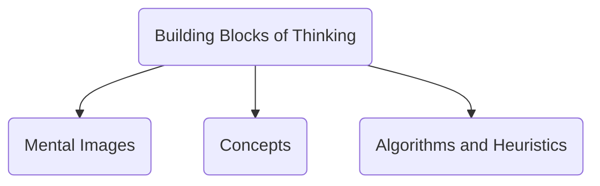
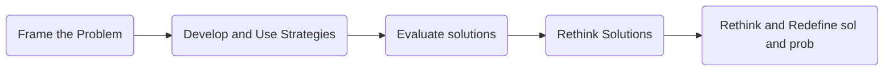
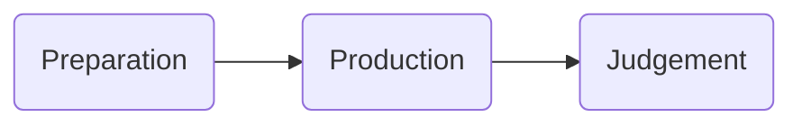
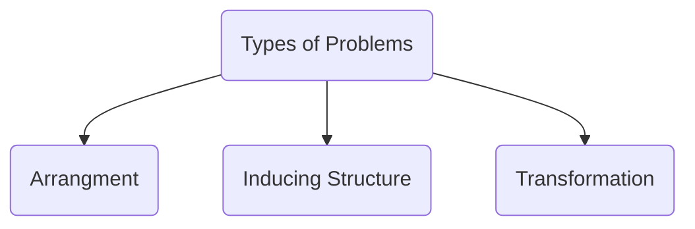
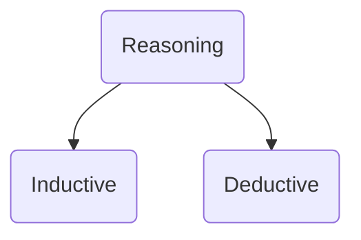

<u>Thinking</u> 
- Meaning and definition  ✔
- Process of thought formation ❓❓❓
- Types of Thinking: Concrete, Abstract, Reflective 
-  Creative and Critical Tools for Thinking: 
	Images, - representations
	Concepts, categorizations
	Prototypes, best examples of categories
	Symbols, - represent something else
	Language - verbal communication helps or some shit like that

<u>Reasoning</u>
- Meaning and definition
- Types of Reasoning: Inductive and Deductive reasoning  🔁

<u>Decision Making</u>
- Meaning and definition Steps in decision making 🔁
- Decision making styles: Directive, Analytical, Conceptual, and Behavioural ❓❓❓
---
## 1. Thinking 
### Meaning and Definition
AKA Cognition (from Latin **Cognitio** - To know)
Thinking is a mental process by which we manipulate ideas, words, and information and use this to solve problems, think critically, reason and make decisions. 
It is the organizing, interpreting, understanding, and communication of information. 

---

## Building blocks of thinking 
Thinking can be discussed about / studied in the form of Mental Images and Concepts. These are the building blocks of thinking.

### 1. Mental Images - 
representations of an object or event in the mind. not necessarily visual. Mental images have same properties as that of real objects. 
><u>For example </u> : 
takes the mind longer to scan mental images of large objects than small ones just like the eye

### 2. Concepts - 
Mental categorization of data based on experience. 
Organize complex phenomena into cognitive categories that are easier to understand and remember. 
Mental grouping of similar objects, people, events, etc. 
 ><u>For example</u> 
>We categorize birds together based on information we've learnt. If it has wings,
>lays eggs, has a beak, it most likely is a bird. 

### Prototypes
> are typical, highly representative examples of a concept that correspond to our mental image or best example of the concept. Eg - Crow is a prototype bird
[[# Concept Formation]]

### 3. Algorithms and heuristics  (???)
Methods of problem-solving. 

## What is Problem Solving?
- It is the process of arriving at a solution
- an attempt to find an appropriate way of attaining a goal when the goal is not readily available 
[[#Steps in Problem Solving]]
--- 
**Algorithms** - A rule, which, if applied appropriately, guarantees a solution to a problem. No errors if used properly. Don't need to know how it works. Eg - a formula

**Heuristics** - Increase the chances of success but not a guaranteed success like algorithms.  Can lead to errors.

---

## Concept Formation 
<u>process</u> in which person learns to sort experiences and objects  into categories based on past experience. 

Important because shapes the way we think about the world. Is the reason we know apple is a fruit. Concepts are important because - 
a. make it possible to generalize
b. hence making it easier to remember and understand objects/events. 
c. allows us to associate objects and experiences 
d. helps us deduce properties of a new object based on past experience

---

## Steps in Problem Solving
1. Frame the problem
2. Develop and use problem solving strategies - use algorithms and heuristics
3. Evaluate solutions 
4. Rethink solutions
5. Rethink and redefine problem and solutions

---

## Obstacles in Problem Solving
<u> Fixation</u> - failing to look from new perspective; only using prior exp
- Functional Fixedness - type of fixation on usual functions of an object
- Mental Set - sticking only to old methods, methods that were successful in the past
<u>Confirmation Bias</u> 

---

## Representation of Problems

---
## Solving a problem - 

---

## Preparation
First step is to **identify** the type of problem

## Types of Problems

1. Arrangement -> Need to rearrange info. E.g. anagrams 
2. Inducing Structure -> Identify existing relationships and create a new one; identify pattern. e.g. - number series
3. Transformation -> consist of initial and goal stage 

---

### Production

come up with as many solutions as possible 
**means-end analysis** is one approach to generate solutions. 
means-ends analysis = comparing differences between desired state and initial state. 
takes us one step closer to the goal
**subgoals** - divide the goal into smaller bits
solve those first. solving each will take you closer to the goal
**insight** - sudden realization or moment of comprehension, *'A-ha' moment* 
sudden awareness of the relationship between objects that appeared to be independent of each other
insight learning experiment - <u>Wolfgang Kohler</u> - Chimpanzee and banana 

---

### Judgement
Evaluating all possible solutions and choosing the right one

---

### Creativity
Ability to come up with novel and original ideas, to think out-of-the-box, divergent thinking

- Convergent thinking -> approaching the problem as if it has only one solution
- Divergent -> Unique and novel ideas

---

## Reasoning 

ability to assess things rationally by applying logic

<u>Inductive Reasoning</u> -
- Inductive Reasoning  
No absolute conclusions. Derived from experience. May not be logical. Used in daily life  

specific -> general or to generalise something

e.g.  Shrimp get cramps. Maybe cramps from shrimps?

<u>Deductive Reasoning</u>
- Deductive Reasoning  
Conclusion must be true if premise is true. 
Premises = basic info that allow people to draw conclusions

go from general -> specific 

---
## Types of thinking 

**Concrete** - Literal thinking, taking it literally, 
**Abstract** - Thinking in symbols and representations
**Reflective** - Think about an experience, something in the past, something that already happened. 
**Convergent** - Limiting focus, linear thinking, thinking logically, 
**Divergent** - Thinking out of the box, lateral thinking, unusual thinking, creative thinking needs this